# Kode Mermaid Diagram Laporan KP NagariSDLC

Salin satu blok kode ke [Mermaid Live Editor](https://mermaid.live), lalu ekspor sebagai SVG atau PNG. Untuk laporan Word, gunakan latar putih, font yang mudah dibaca, dan resolusi tinggi. Kode ini hanya memodelkan NagariSDLC; bagan organisasi D-02 tetap harus disesuaikan dengan struktur resmi instansi.

## D-01 - Alur end-to-end NagariSDLC

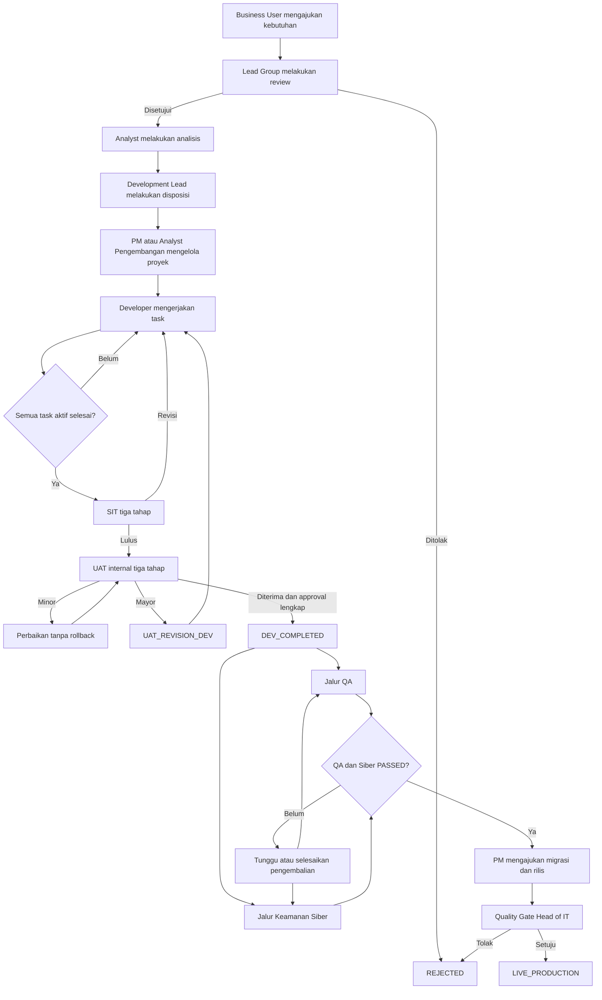

## D-01A - Proses sebelum sistem terpusat

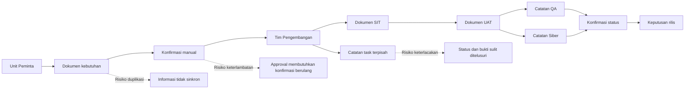

## D-02 - Struktur unit representatif

> Ganti nama unit dan jabatan dengan struktur resmi Bank Nagari sebelum dimasukkan ke laporan.

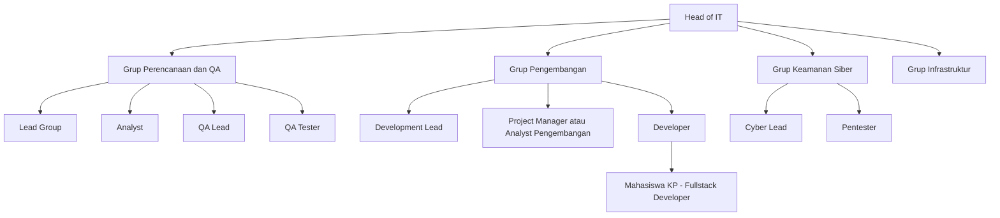

## D-03 - Arsitektur sistem

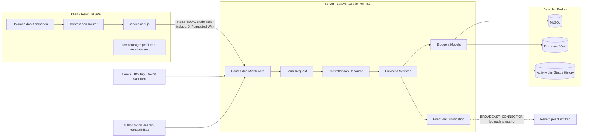

## D-04 - Use case aktor utama

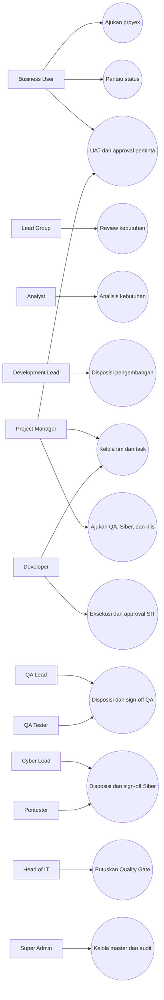

## D-05 - State machine proyek

```mermaid
stateDiagram-v2
    [*] --> PENDING
    PENDING --> IN_REVIEW
    PENDING --> REJECTED
    PENDING --> CANCELLED
    IN_REVIEW --> ANALYSIS_APPROVED
    IN_REVIEW --> PENDING
    IN_REVIEW --> REJECTED
    ANALYSIS_APPROVED --> READY_FOR_DEVELOPMENT
    ANALYSIS_APPROVED --> IN_REVIEW
    READY_FOR_DEVELOPMENT --> DEV_ANALYSIS
    READY_FOR_DEVELOPMENT --> IN_DEVELOPMENT
    DEV_ANALYSIS --> DEV_ANALYSIS_DONE
    DEV_ANALYSIS_DONE --> IN_DEVELOPMENT
    IN_DEVELOPMENT --> SIT_IN_PROGRESS
    IN_DEVELOPMENT --> DEV_COMPLETED
    IN_DEVELOPMENT --> ON_HOLD
    SIT_IN_PROGRESS --> SIT_PASSED
    SIT_IN_PROGRESS --> SIT_REVISION
    SIT_REVISION --> IN_DEVELOPMENT
    SIT_REVISION --> SIT_IN_PROGRESS
    SIT_PASSED --> UAT_IN_PROGRESS
    SIT_PASSED --> DEV_COMPLETED
    UAT_IN_PROGRESS --> UAT_PASSED
    UAT_IN_PROGRESS --> DEV_COMPLETED
    UAT_IN_PROGRESS --> UAT_REVISION_DEV
    UAT_IN_PROGRESS --> UAT_REVISION_SIT
    UAT_REVISION_DEV --> IN_DEVELOPMENT
    UAT_REVISION_DEV --> SIT_IN_PROGRESS
    UAT_REVISION_SIT --> SIT_IN_PROGRESS
    UAT_PASSED --> DEV_COMPLETED
    DEV_COMPLETED --> READY_FOR_QA
    DEV_COMPLETED --> QA_IN_PROGRESS
    DEV_COMPLETED --> CYBER_IN_PROGRESS
    READY_FOR_QA --> QA_IN_PROGRESS
    READY_FOR_QA --> CYBER_IN_PROGRESS
    QA_IN_PROGRESS --> QA_PASSED
    QA_IN_PROGRESS --> RETURN_TO_DEV
    CYBER_IN_PROGRESS --> CYBER_PASSED
    CYBER_IN_PROGRESS --> RETURN_TO_DEV
    RETURN_TO_DEV --> IN_DEVELOPMENT
    RETURN_TO_DEV --> READY_FOR_QA
    QA_PASSED --> PENDING_GOLIVE: cyber_status PASSED
    CYBER_PASSED --> PENDING_GOLIVE: qa_status PASSED
    PENDING_GOLIVE --> LIVE_PRODUCTION
    PENDING_GOLIVE --> REJECTED
    ON_HOLD --> IN_DEVELOPMENT
    ON_HOLD --> PENDING
    REJECTED --> PENDING
    REJECTED --> IN_REVIEW
    LIVE_PRODUCTION --> [*]
    CANCELLED --> [*]

    note right of READY_FOR_UAT
      Legacy: tidak memiliki
      transisi masuk atau keluar
    end note
```

## D-06 - Alur SIT

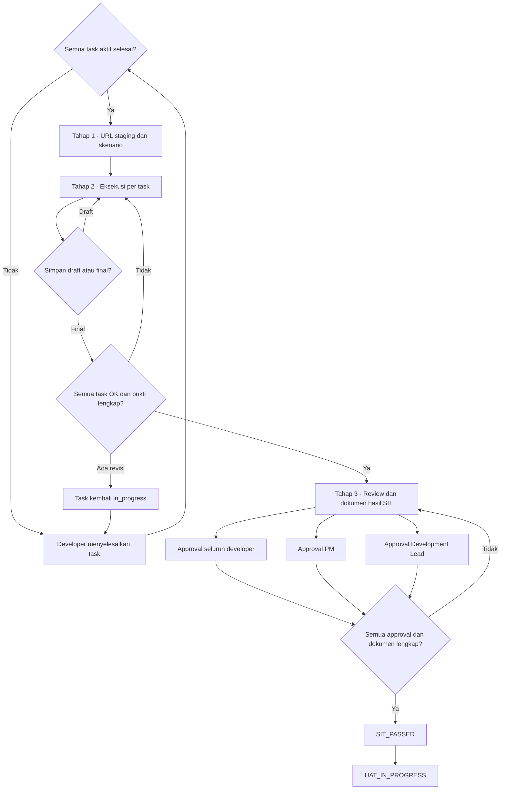

## D-07 - Alur UAT

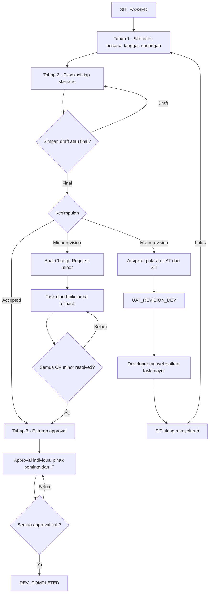

## D-08 - Jalur QA dan keamanan siber

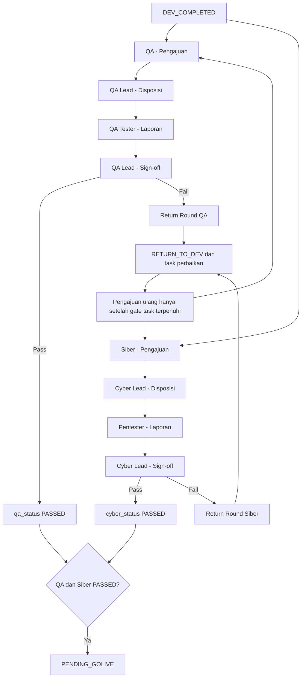

## D-09 - Relasi approver UAT

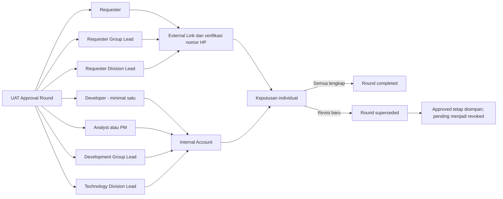

## D-10 - Putaran pengembalian pengujian

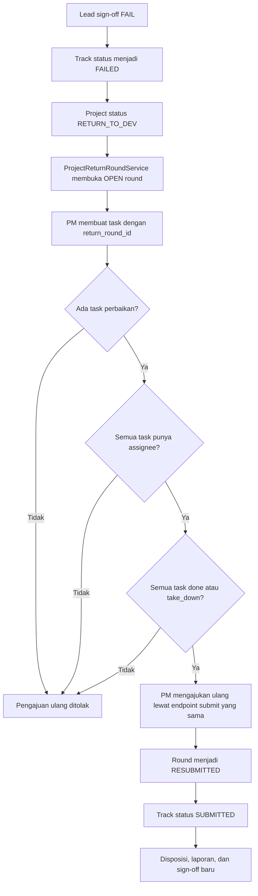

## D-11 - ERD NagariSDLC

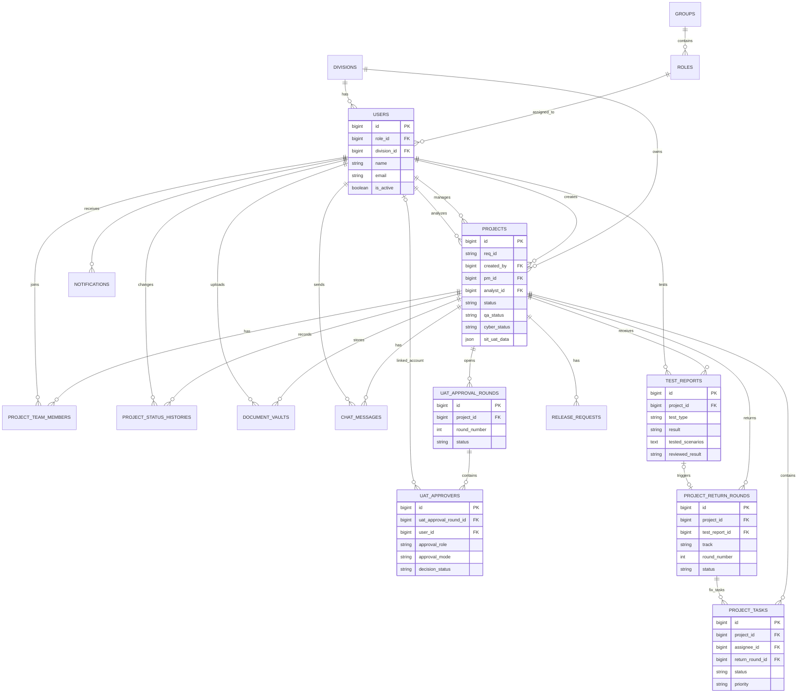

## D-12 - Class relationship inti

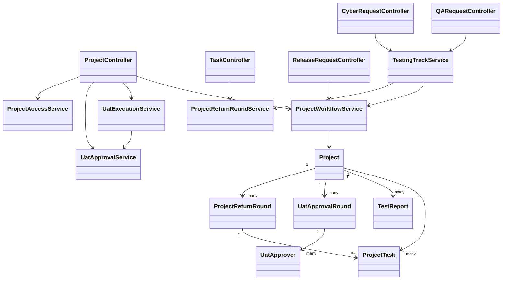

## D-13 - Sequence login

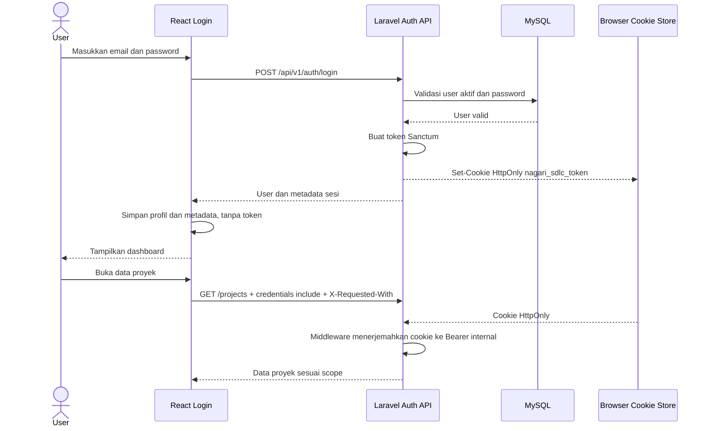

## D-14 - Sequence persetujuan UAT eksternal

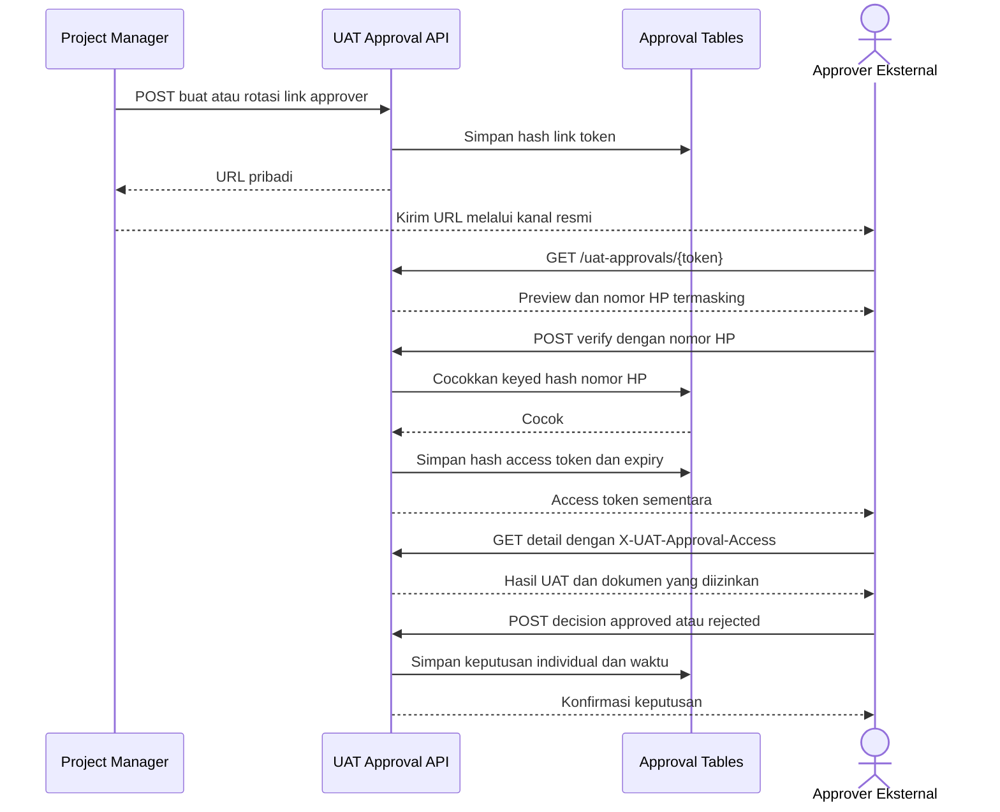

## D-15 - Peta navigasi halaman

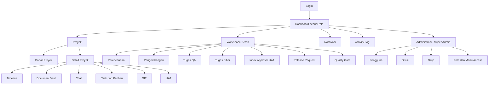
